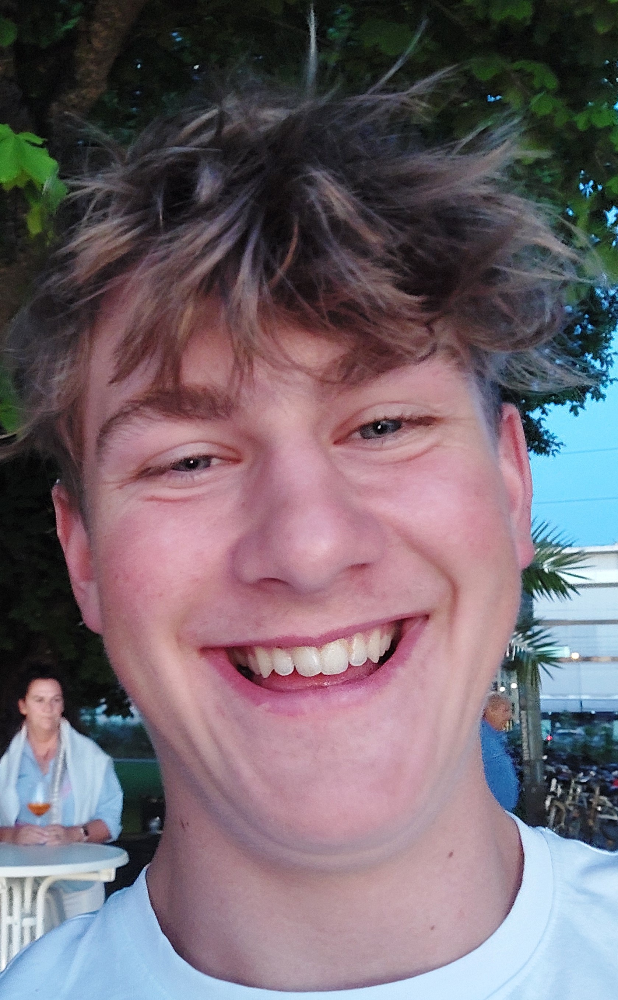
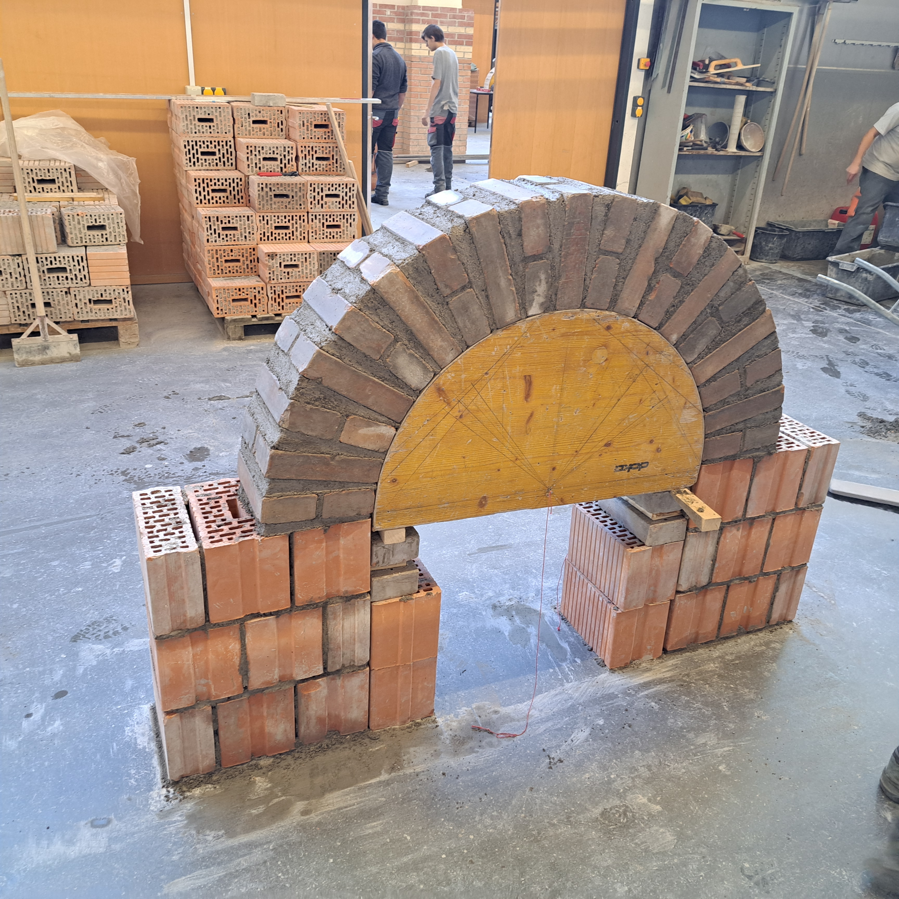

# bartawebdesign
Barta Webdesign – moderne, schnelle Webseiten für kleine Unternehmen in Vorarlberg. Fokus auf professionelles Design, SEO-Sichtbarkeit und Performance. Damit Ihre Seite gefunden wird und überzeugt.
<!DOCTYPE html>
<html lang="de">
<head>
  <meta charset="UTF-8" />
  <meta name="viewport" content="width=device-width, initial-scale=1.0" />
  <title>Über mich</title>
  <link rel="stylesheet" href="style.css" />
</head>
<body>
  <nav class="navbar">
    <ul>
      <li><a href="index.html">Home</a></li>
      <li><a class="active" href="aboutme.html">Über mich</a></li>
      <li><a href="kontakt.html">Kontakt</a></li>
      <li><a href="projekt.html">Projekte</a></li>
    </ul>
  </nav>

  <main>
    <section id="about" class="about">
      

        <h1>Über mich</h1>
        

          

            

              Ich bin ein engagierter Fachmann mit Leidenschaft für moderne
              Webentwicklung und klare, nutzerfreundliche Gestaltung. In meiner
              Arbeit verbinde ich Kreativität mit technischer Präzision, um
              eindrucksvolle digitale Erlebnisse zu schaffen.
            

          

          

            
          

        

      

    </section>
  </main>
</body>
</html>
<!DOCTYPE html>
<html lang="de">
<head>
  <meta charset="UTF-8" />
  <meta name="viewport" content="width=device-width, initial-scale=1.0" />
  <title>Meine Seite</title>
  <link rel="preconnect" href="https://fonts.googleapis.com" />
  <link rel="preconnect" href="https://fonts.gstatic.com" crossorigin />
  <link href="https://fonts.googleapis.com/css2?family=Poppins:wght@400;700&display=swap" rel="stylesheet" />
  <link rel="stylesheet" href="style.css" />
</head>
<body>
  <nav class="navbar">
    <ul>
      <li><a class="active" href="index.html">Home</a></li>
      <li><a href="aboutme.html">Über mich</a></li>
      <li><a href="kontakt.html">Kontakt</a></li>
      <li><a href="projekt.html">Projekte</a></li>
    </ul>
  </nav>

  <main>
    <section id="home" class="home">
      

        

          
        

        

          <h1>Willkommen!</h1>
          

            Hier kann ein kurzer Begrüßungstext stehen, der den Besucher
            willkommen heißt oder eine Einführung in die Webseite gibt.
          

          

            <a class="btn primary" href="kontakt.html">Kontakt aufnehmen</a>
            <a class="btn secondary" href="projekt.html">Projekte ansehen</a>
          

        

      

    </section>
  </main>
</body>
</html>
<!DOCTYPE html>
<html lang="de">
<head>
  <meta charset="UTF-8" />
  <title>Kontakt – Pablo</title>
  <meta name="description" content="Projektanfragen, Kooperationen, Fragen. Standort Sulzberg (Vorarlberg). Antwort i. d. R. < 24h." />
  <link rel="stylesheet" href="style.css" />
</head>
<body>
  <nav class="navbar">
    <ul>
      <li><a href="index.html">Home</a></li>
      <li><a href="aboutme.html">Über mich</a></li>
      <li><a class="active" href="kontakt.html">Kontakt</a></li>
      <li><a href="projekt.html">Projekte</a></li>
    </ul>
  </nav>
  <main>
    <section class="kontakt-section">
      

        

          <h1>Kontakt</h1>
          
Kurzer Draht, klare Angebote, verlässliche Timelines.

          <ul class="info-list">
            <li class="info-item">
              E-Mail:
              <a href="mailto:hello@deinedomain?subject=Projektanfrage">hello@deinedomain</a>
              <button class="copy-btn" data-copy="hello@deinedomain" aria-label="E-Mail kopieren">📋</button>
            </li>
            <li class="info-item">
              Telefon/WhatsApp:
              <a href="tel:+43deineNummer">+43 deineNummer</a>
              <button class="copy-btn" data-copy="+43 deineNummer" aria-label="Telefon kopieren">📋</button>
            </li>
            <li class="info-item">Standort: Sulzberg, Vorarlberg, AT</li>
            <li class="info-item">Erreichbarkeit: Mo–Fr 09:00–17:00 (CET/CEST)</li>
          </ul>
          

            <a class="btn primary" href="mailto:hello@deinedomain?subject=Projektanfrage">E-Mail senden</a>
            <a class="btn secondary" href="tel:+43deineNummer">Anrufen</a>
          

          

            <a href="https://www.linkedin.com" target="_blank" rel="me noopener">🔗</a>
            <a href="https://github.com" target="_blank" rel="me noopener">💻</a>
            <a href="https://www.instagram.com" target="_blank" rel="me noopener">📷</a>
          

        

        

          <h2>vCard</h2>
          <a class="btn secondary" href="pablo.vcf" download>Download vCard</a>
          
        

      

      
Kopiert ✓

    </section>
  </main>
  
</body>
</html>
BEGIN:VCARD
VERSION:3.0
FN:Pablo
EMAIL:hello@deinedomain
TEL:+43 deineNummer
ADR:;;Sulzberg;Vorarlberg;;AT
END:VCARD
<!DOCTYPE html>
<html lang="de">
<head>
  <meta charset="UTF-8" />
  <meta name="viewport" content="width=device-width, initial-scale=1.0" />
  <title>Projekte</title>
  <link rel="stylesheet" href="style.css" />
</head>
<body>
  <nav class="navbar">
    <ul>
      <li><a href="index.html">Home</a></li>
      <li><a href="aboutme.html">Über mich</a></li>
      <li><a href="kontakt.html">Kontakt</a></li>
      <li><a class="active" href="projekt.html">Projekte</a></li>
    </ul>
  </nav>
  <main>
    <section class="projects-section">
      

        <header class="projects-header">
          <h1>Projekte</h1>
          
Eine Auswahl meiner Arbeiten, die Hintergrund &amp; Resultate hervorhebt.

        </header>
        

          <button class="arrow prev" aria-label="Vorheriges Projekt">&#10094;</button>
          

            

              
              <h2>Projekt Eins</h2>
              
Problem skizzieren, Lösung erläutern und das Ergebnis hervorheben.

            

            

              
              <h2>Projekt Zwei</h2>
              
Problem skizzieren, Lösung erläutern und das Ergebnis hervorheben.

            

            

              
              <h2>Projekt Drei</h2>
              
Problem skizzieren, Lösung erläutern und das Ergebnis hervorheben.

            

          

          <button class="arrow next" aria-label="Nächstes Projekt">&#10095;</button>
          

            
            
            
          

        

      

    </section>
  </main>
  
</body>
</html>
body {
  margin: 0;
  font-family: 'Poppins', sans-serif;
  background-color: #fff;
}

/* Navigation */
.navbar ul {
  list-style: none;
  display: flex;
  justify-content: space-evenly;
  align-items: center;
  margin: 0;
  padding: 0;
  background-color: #333;
}

.navbar li {
  padding: 1rem;
}

.navbar a {
  color: white;
  text-decoration: none;
  font-weight: bold;
}

.navbar a:hover,
.navbar a.active {
  color: #f4d03f;
}

/* Home-Bereich */
.home .split-container {
  display: flex;
  max-width: 1200px;
  margin: 2rem auto;
  background-color: #F9FAFB;
  border-radius: 1.5rem;
  box-shadow: 0 10px 15px -3px rgba(0, 0, 0, 0.1), 0 4px 6px -4px rgba(0, 0, 0, 0.1);
  overflow: hidden;
}

.image-side,
.text-side {
  flex: 1;
  display: flex;
}

.image-side {
  align-items: center;
  justify-content: center;
}

.text-side {
  flex-direction: column;
  justify-content: center;
  align-items: center;
  padding: 2rem;
  text-align: center;
}

.text-side h1 {
  margin-top: 0;
  margin-bottom: 1rem;
  font-size: 3rem;
  font-weight: 700;
}

.text-side p {
  text-align: justify;
  line-height: 1.6;
}

/* CTA buttons within home section */
.home .cta-buttons {
  margin-top: 1.5rem;
  justify-content: center;
}

/* Bild soll in den Bereich passen */
.image-side img {
  width: 400px;
  height: 600px;
  object-fit: contain;
  border-radius: 0.5rem;
}

@media (max-width: 768px) {
  .home .split-container {
    flex-direction: column;
  }
  .text-side {
    order: 1;
  }
  .image-side {
    order: 2;
  }
  .text-side h1 {
    font-size: 2.25rem;
  }
}

/* Über-mich-Bereich */
.about-container {
  max-width: 1200px;
  margin: 2rem auto;
  padding: 32px 24px;
  background-color: #f9f9f9;
  border-radius: 8px;
  box-shadow: 0 2px 4px rgba(0, 0, 0, 0.1);
}

.about-container h1 {
  text-align: center;
  margin-top: 0;
  margin-bottom: 1.5rem;
}

.about-content {
  display: flex;
  align-items: center;
  gap: 2rem;
}

.about-text,
.about-image {
  padding: 32px 24px;
}

@media (max-width: 768px) {
  .about-content {
    flex-direction: column;
    gap: 1.5rem;
  }
}

.about-text {
  flex: 1;
  font-family: "Georgia", serif;
  text-align: justify;
}

.about-image {
  flex: 1;
  display: flex;
  justify-content: center;
}

.about-image img {
  width: 250px;
  height: 250px;
  object-fit: cover;
  border-radius: 50%;
  border: 4px solid #ddd;
}

/* Kontakt-Bereich */
.kontakt-section {
  padding: 4rem 1rem;
}

.contact-container {
  max-width: 1200px;
  margin: 2rem auto 0;
  display: grid;
  gap: 2rem;
  grid-template-columns: 1fr;
}

@media (min-width: 1024px) {
  .contact-container {
    grid-template-columns: repeat(2, 1fr);
  }
}

.contact-card {
  background-color: #F8FAFC;
  border: 1px solid #E5E7EB;
  border-radius: 1rem;
  box-shadow: 0 2px 4px rgba(0, 0, 0, 0.05);
  padding: 32px 24px;
}

.contact-card h1,
.contact-card h2 {
  margin-top: 0;
  text-align: center;
}

.info-list {
  list-style: none;
  padding: 0;
  margin: 1rem 0 2rem;
}

.info-item {
  margin-bottom: 1rem;
  display: flex;
  align-items: center;
  flex-wrap: wrap;
  gap: 0.5rem;
}

.info-item a {
  color: #2563eb;
  text-decoration: none;
  transition: color 0.2s;
}

.info-item a:hover {
  color: #1d4ed8;
}

.info-item .label {
  font-weight: 600;
  font-size: 1rem;
  width: 160px;
}

.info-item .value {
  flex: 1;
}

.copy-btn {
  background: none;
  border: none;
  cursor: pointer;
  font-size: 1rem;
}

.cta-buttons {
  display: flex;
  gap: 1rem;
  margin: 1.5rem 0;
  flex-wrap: wrap;
}

.cta-buttons .btn {
  flex: 1;
}

  .btn {
    text-decoration: none;
    padding: 0.75rem 1.5rem;
    border-radius: 0.5rem;
    display: inline-block;
    text-align: center;
    font-size: 1rem;
    transition: background-color 0.2s, color 0.2s, border-color 0.2s;
  }

  .btn.primary {
    background-color: #2563eb;
    color: #fff;
  }

  .btn.primary:hover {
    background-color: #1d4ed8;
  }

  .btn.secondary {
    background-color: transparent;
    color: #2563eb;
    border: 2px solid #2563eb;
  }

  .btn.secondary:hover {
    background-color: #2563eb;
    color: #fff;
  }

.socials {
  display: flex;
  gap: 1rem;
  justify-content: center;
}

.socials a {
  font-size: 0;
  width: 24px;
  height: 24px;
  display: inline-block;
  color: #111;
  transition: color 0.2s;
}

.socials a:nth-child(1)::before {
  content: "";
  display: block;
  width: 100%;
  height: 100%;
  background: url('data:image/svg+xml;base64,PHN2ZyB4bWxucz0iaHR0cDovL3d3dy53My5vcmcvMjAwMC9zdmciIHZpZXdCb3g9IjAgMCAyNCAyNCIgZmlsbD0ibm9uZSIgc3Ryb2tlPSJjdXJyZW50Q29sb3IiIHN0cm9rZS13aWR0aD0iMiIgc3Ryb2tlLWxpbmVjYXA9InJvdW5kIiBzdHJva2UtbGluZWpvaW49InJvdW5kIj48cGF0aCBkPSJNMTAgMTNhNSA1IDAgMDA3LjU0LS41NGwxLTFhNSA1IDAgMDAtNy4wNy03LjA3bC0xIDEiLz48cGF0aCBkPSJNMTQgMTFhNSA1IDAgMDAtNy41NC41NGwtMSAxYTUgNSAwIDAwNy4wNyA3LjA3bDEtMSIvPjwvc3ZnPg==') center/contain no-repeat;
}

.socials a:nth-child(2)::before {
  content: "";
  display: block;
  width: 100%;
  height: 100%;
  background: url('data:image/svg+xml;base64,PHN2ZyB4bWxucz0iaHR0cDovL3d3dy53My5vcmcvMjAwMC9zdmciIHZpZXdCb3g9IjAgMCAyNCAyNCIgZmlsbD0ibm9uZSIgc3Ryb2tlPSJjdXJyZW50Q29sb3IiIHN0cm9rZS13aWR0aD0iMiIgc3Ryb2tlLWxpbmVjYXA9InJvdW5kIiBzdHJva2UtbGluZWpvaW49InJvdW5kIj48cG9seWxpbmUgcG9pbnRzPSIxNiAxOCAyMiAxMiAxNiA2Ii8+PHBvbHlsaW5lIHBvaW50cz0iOCA2IDIgMTIgOCAxOCIvPjwvc3ZnPg==') center/contain no-repeat;
}

.socials a:nth-child(3)::before {
  content: "";
  display: block;
  width: 100%;
  height: 100%;
  background: url('data:image/svg+xml;base64,PHN2ZyB4bWxucz0iaHR0cDovL3d3dy53My5vcmcvMjAwMC9zdmciIHZpZXdCb3g9IjAgMCAyNCAyNCIgZmlsbD0ibm9uZSIgc3Ryb2tlPSJjdXJyZW50Q29sb3IiIHN0cm9rZS13aWR0aD0iMiIgc3Ryb2tlLWxpbmVjYXA9InJvdW5kIiBzdHJva2UtbGluZWpvaW49InJvdW5kIj48cGF0aCBkPSJNMjMgMTlhMiAyIDAgMCAxLTIgMkgzYTIgMiAwIDAgMS0yLTJWN2EyIDIgMCAwIDEgMi0yaDRsMi0zaDZsMiAzaDRhMiAyIDAgMCAxIDIgMnoiLz48Y2lyY2xlIGN4PSIxMiIgY3k9IjEzIiByPSI0Ii8+PC9zdmc+') center/contain no-repeat;
}

.socials a:hover {
  color: #2563eb;
}

.qr {
  display: block;
  margin: 0 auto;
  max-width: 240px;
  width: 100%;
}

.contact-container .contact-card:nth-child(2) {
  display: flex;
  flex-direction: column;
  align-items: center;
}

.contact-container .contact-card:nth-child(2) .qr {
  order: 1;
  margin-bottom: 1rem;
}

.contact-container .contact-card:nth-child(2) .btn {
  order: 2;
  font-size: 0;
  margin-top: 0.5rem;
}

.contact-container .contact-card:nth-child(2) .btn::after {
  content: 'vCard herunterladen';
  font-size: 1rem;
}

.toast {
  position: fixed;
  bottom: 1rem;
  left: 50%;
  transform: translateX(-50%);
  background: #333;
  color: #fff;
  padding: 0.5rem 1rem;
  border-radius: 0.5rem;
  opacity: 0;
  transition: opacity 0.3s;
}

.toast.show {
  opacity: 1;
}

/* Projekte-Bereich */
.projects-section {
  background-color: #fff;
}

.projects-wrapper {
  max-width: 64rem;
  margin: 0 auto;
  padding: 4rem 1.5rem;
  text-align: center;
}

.projects-header h1 {
  font-size: 2.25rem;
  font-weight: bold;
  color: #111827;
}

@media (min-width: 768px) {
  .projects-header h1 {
    font-size: 3rem;
  }
}

.projects-header .subline {
  color: #6B7280;
  max-width: 40rem;
  margin: 0.5rem auto 2rem;
}

.project-slider {
  position: relative;
  margin-bottom: 2rem;
}

.project-cards {
  display: flex;
  overflow: hidden;
}

.project-card {
  min-width: 100%;
  background-color: #F9FAFB;
  border-radius: 1rem;
  box-shadow: 0 4px 8px rgba(0, 0, 0, 0.05);
  padding: 2rem;
  display: none;
  flex-direction: column;
  align-items: center;
  transition: transform 0.3s ease-in-out, box-shadow 0.3s ease-in-out;
}

.project-card.active {
  display: flex;
}

.project-card img {
  width: 400px;
  height: 300px;
  object-fit: cover;
  border-radius: 0.5rem;
  margin-bottom: 1rem;
}

.project-card h2 {
  font-size: 1.25rem;
  margin: 0.5rem 0;
  color: #111827;
}

.project-card p {
  color: #4B5563;
  max-width: 40rem;
}

.project-card:hover {
  transform: scale(1.05);
  box-shadow: 0 8px 16px rgba(0, 0, 0, 0.1);
}

.arrow {
  position: absolute;
  top: 50%;
  transform: translateY(-50%);
  background: none;
  border: none;
  font-size: 2rem;
  cursor: pointer;
  color: #111827;
  z-index: 10;
}

.arrow.prev {
  left: 1rem;
}

.arrow.next {
  right: 1rem;
}

.dots {
  display: flex;
  justify-content: center;
  gap: 0.5rem;
  margin-top: 1rem;
}

.dot {
  width: 0.75rem;
  height: 0.75rem;
  background-color: #9ca3af;
  border-radius: 50%;
  cursor: pointer;
}

.dot.active {
  background-color: #000;
}

@media (max-width: 640px) {
  .arrow {
    font-size: 1.5rem;
  }

  .dot {
    width: 0.875rem;
    height: 0.875rem;
  }
}
